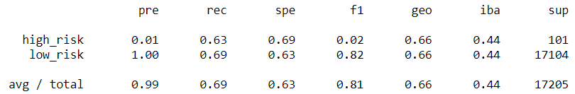

# Credit Risk Analysis

## Overview
Using the credit card credit dataset from LendingClub, a peer-to-peer lending services company, we oversample the data using the Random Over Sampler and SMOTE algorithms, and undersample the data using the Cluster Centroids algorithm and then, using a combinatorial approach of over and undersampling using the SMOTEENN algorithm. We combine these sampling techniques with a Logistic Regression model,to compare the predictions based on these resampled datasets.
Next, we compare two machine learning models that reduce bias, Balanced Random Forest Classifier (BRF) and Easy Ensemble AdaBoost Classifier (EE), to predict credit risk. 
Finally, we evaluate the performance of these models and recommend on whether they should be used to predict credit risk.

## Results
The following table show the balanced accuracy score, confusion matrix and imbalanced classification report for each of the models:

|Resampling Comparison |Sampling Type    | Accuracy Score   | Confusion Matrix       | Classification Report  |
|:--------------------:|:---------------:|:----------------:|:----------------------:|:----------------------:|
|**RandomOverSampler** |Over Sampling    |0.6503524738582371|  |  |
|**SMOTE**             |Over Sampling    |0.6621602612787003|||
|**Cluster Centroids** |Under Sampling   |0.5442166848817717|   |   |
|**SMOTEEN**           |Combined Sampling|0.644711676499736 | | |
|**BRF**               |Under Sampling   |0.7885466545953005|  |  |
|**EE**                |Under Sampling   |0.9316600714093861|   |   |

## Summary
As can be seen from the previous table, the best results by far, were obtained by the Easy Ensemble AdaBoost Classifier (EE). Itis important to consider that when lending money, misclassifying a high-risk could result in the lost of the full amount, while misclassifying a low-risk is the lost of the iterest over the loan. Due to the risk of loosing the complete loan to a misclassified high-risk, we should be looking for a model that has precision over a defined limit that dependson how risk-averse is the user. This means that if we want to be correct 95% of the time, we would suggest ***not*** using any of the models shown above. 

